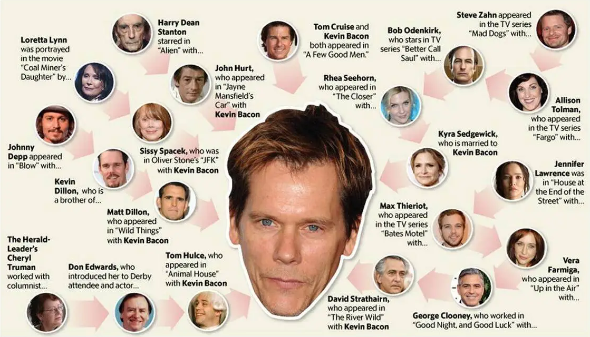
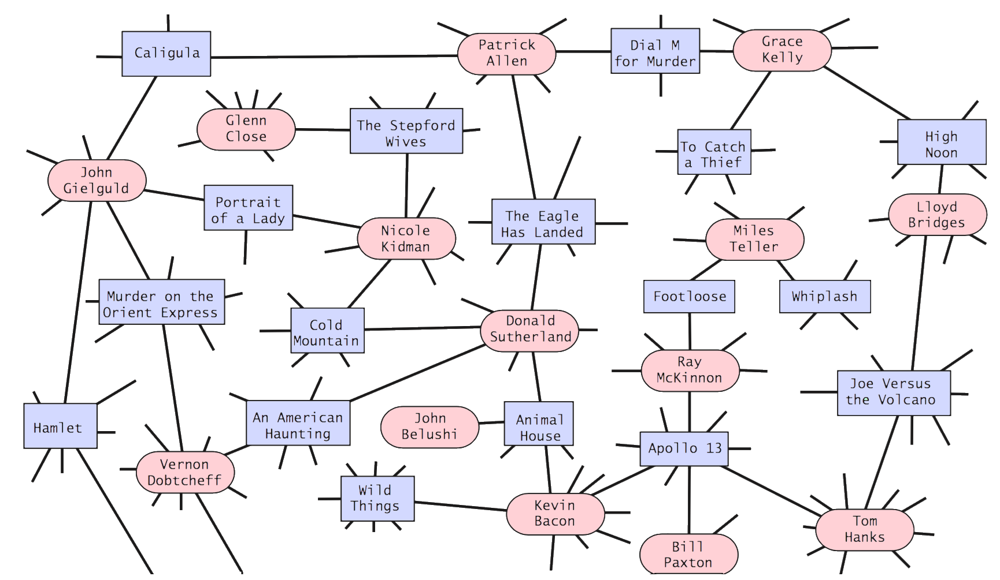

# Overview

The number of relationships that exist between people, in any problem domain, is often surprising. 
Our world is becoming more and more interconnected, a concept that was explored by the social 
psychologist Stanley Milgram in the 1960s. Milgram is known for his "small world" experiment, 
which is described on the following [Wikipedia page](https://en.wikipedia.org/wiki/Small-world_experiment).

## The Milgram Experiment

The goal of the experiment was to create a chain of correspondence between distant individuals 
who did not share a direct relationship. If the source of the correspondence did not know the 
destination individual, then perhaps it is likely they knew someone who knew the individual. 
As part of the experiment any person who received a piece of correspondence was asked to:

- forward the correspondence to the destination if they knew the person
- otherwise forward the correspondence to relations that were likely to know the person


The results of Milgram's experiment were surprising in that the correspondence often reached the 
destination in around 5-6 steps (or relationships). This resulted in the now-popular saying 
"six-degrees of separation."

## The Kevin Bacon Game

Initially created as a parlor game, the "Kevin Bacon Game" models the relationships between 
actors/actresses in Hollywood with respect to Kevin Bacon. The game illustrates the concept 
of six-degrees of separation, where it tracks actors/actresses who starred in similar movies 
and then provides a bacon number. This number represents the minimum number of relationships 
that separate an actor/actress from Kevin Bacon.

An example of these types of relationships can be seen below. Please note that the image below 
does not show all relationships between actors/actresses, but is an example of what types of 
connections exist.



From the diagram above you would have the following bacon numbers:

- Bob Odenkirk: 2
- Steve Zahn: 4
- Sissy Spacek: 1
- Johnny Depp: 3

This diagram also displays a principle of the Kevin Bacon game, where it is difficult to 
find individuals with a high bacon number. For example, at the time of this writing, 
the following bacon numbers can be found with a quick Google search.

- Justin Bieber (singer): 2
- Barrack Obama (previous president): 2
- Paul Erdos (famous mathematician): 4
- Mark Zuckerberg (social network CEO): 3
- Evel Knievel (stunt man): 2
- You: ???

Note: These numbers will often change as new movies, documentaries, and shows are released. 
Thus lowering different bacon numbers.

## Graph Theory

The phenomena of six-degrees of separation can be seen in all types of networks and is an 
interesting application of graph structures. The goal of this assignment is to read movie 
& actor data into a program, model the relationships in a graph, and then calculate bacon 
numbers (with a twist).  Instead of bacon numbers, we will be writing a program that 
calculates the distance between actors/actresses using any central figure in Hollywood. 
For example, you could calculate "Lawrence numbers" for Jennifer Lawrence or "Connery numbers" 
for Sean Connery.

A question we want to directly answer is "which actor or actress is really at the 
center of Hollywood?"

## Setup

To start, review the files you have been provided in the project:
- **files**: a directory containing several data sets with actor/actress names and the movies 
  they star in
- **IGraph, MyGraph**: an interface and class representing an undirected graph
- **DataPoint**: a helper class used to store movies or actors/actresses in the graph
- **MoviesIO**: a data layer for reading from text files in the files directory
- **Console & Main class**: these classes will contain code for the Kevin Bacon game running 
  on the Java console.

Before moving on, take a moment to consider the format of the text files. You should try to identify where actor/actress names are stored on each line as well as movies they star in. For example:

## Building a Graph

Your first programming task is to assemble a graph object that can be used to generate "actor numbers." Recall that an actor number is like a "Bacon number" except that you can choose any actor as the source vertex. The provided MyGraph class should be sufficient for this problem. The graph object you instantiate should store both movie titles and actor/actress names in the graph, with an edge between an actor/actress and the movies they have starred in.

For example:



To help store different types of vertices, you have been provided the DataPoint class to store either of the two types of vertex values. The `isActor` boolean field can be used to differentiate between the names at each vertex. This means that your generic type for the graph will look like the following:

```java
MyGraph<DataPoint> actorNumberGraph = new MyGraph<>();
```

## Calculating Actor Numbers

As part of your solution, you will need to use this graph to calculate actor numbers based on a source vertex (containing an actor name) in the graph. To start, you should add a method which does this calculation. For example:

```java 
public Map<String, Integer> generateActorNumbers(String actorSource)
{
    //do some work and return a map of actor to "actor numbers"
}
```

This method should use a graph traversal to determine each actor number. Of the two traversals we have covered (DFS and BFS), you should use breadth-first search. You should not be using depth-first-search. Take a moment and consider why this is the case.

There are also several complications when writing BFS on the graph. These will need to be addressed in your code:

- You need to keep a counter for each group of neighbor actors/actresses traversed from your source vertex.
    - All neighbor (actors/actresses) should have an actor number of 1
    - All neighbors of neighbors (actors/actresses) should have an actor number of 2
    - All neighbors of neighbors of neighbors (actors/actresses) should have an actor number of 3
    - And so forth...
- Your traversal will generally skip movies during the traversal. Even so, your calculations will need to address when a group of movies have been visited and then the next vertex is an actor. In this situation the counter for the actor number should increase.

## Console Program

Lastly, write a console program that allows a user to do the following:

- Load an input file of their choice
- List actors or movies from the data set
- Calculate actor numbers by:
    - Building a graph based on the input file
    - Entering a source actor/actress name
    - Listing the actor numbers and the average actor number

Some examples:

```text 
Welcome to my Kevin Bacon Game!
*******************************

Please choose one of the following files:
0: 400_actors.txt
1: 200_actors.txt
2: 100_actors.txt
3: 50_actors.txt
2

Loaded 115 actors and 8859 movies

Make a choice: 
1. List Actors
2. List Movies
3. Calculate Actors Numbers
4. Exit

Make a choice: 
1. List Actors
2. List Movies
3. Calculate Actors Numbers
4. Exit
1

Actor: adrian pasdar
Actor: albert finney
Actor: alberta watson
Actor: angela bassett
Actor: anne heche
Actor: antony sher
...

Make a choice: 
1. List Actors
2. List Movies
3. Calculate Actors Numbers
4. Exit
2

Movie: double take
Movie: "heroes"
Movie: big time
Movie: bordeaux
Movie: "burn notice"
Movie: "house of frankenstein"
...

Make a choice: 
1. List Actors
2. List Movies
3. Calculate Actors Numbers
4. Exit
3

Enter an actor/actress name: jim carrey
Found actor!

jim carrey numbers:
adrian pasdar -> 1
albert finney -> 1
alberta watson -> 2
angela bassett -> 1
anne heche -> 1
antony sher -> 2
...
tony danza -> 1
uma thurman -> 1
val kilmer -> 1
whoopi goldberg -> 1
william shatner -> 2

Average actor number: 1.2522522522522523

Make a choice: 
1. List Actors
2. List Movies
3. Calculate Actors Numbers
4. Exit
4
Process finished with exit code 0
```

## Requirements

Any submissions ignoring the following requirements will be required to resubmit their work:

- Implementations of graphs that store actors or movies as edges in the graph will not be accepted.
- Implementations of graphs that do not store movies directly in the graph will not be accepted.
- Your program must be able to read all the input files in the provided zip file. Test this before you submit your work.